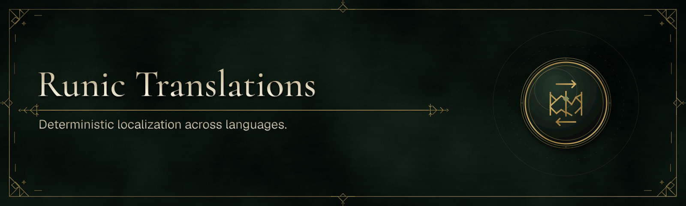

# Runic Translations

Runic Translations is a deterministic, language-neutral localization system.
It started inside Runic Toolkit, but its contracts, compiler, runtime, generator,
build integration, and command-line tool are intentionally independent of any UI
framework.

The portable contract family is named `runic.textresources/1`. Package versions
evolve independently from its versioned source schemas, message grammar, generated
artifacts, and runtime ABI.

## Packages

| Package | Purpose |
|---|---|
| `RunicTextResources` | NativeAOT-compatible .NET runtime contracts and snapshots |
| `RunicTextResources.Compiler` | Deterministic, UI-independent compiler kernel |
| `RunicTextResources.Authoring` | Supported workspace and project-authoring operations for tooling |
| `RunicTextResources.Generator` | Incremental C# source generator |
| `RunicTextResources.Build` | Dependency-free MSBuild integration |
| `RunicTextResources.Tool` | `runic-textresources` validation and generation tool |
| `RunicTextResources.Templates` | Minimal item and standalone .NET project templates |
| `@runic-artifex/vite-plugin-text-resources` | Optional virtual-module, watch, and HMR adapter |

The normative schemas and compatibility corpus live in [`spec/`](spec/README.md).
The `.NET` implementation is under [`dotnet/`](dotnet/).
The implemented .NET and TypeScript/ESM architecture and delivery record are in
[`docs/cross-runtime-plan.md`](docs/cross-runtime-plan.md).

The customer-facing [Runic Translations Editor](https://github.com/Runic-Artifex/runic-translations-editor)
is developed and released from its own repository. It consumes these packages
as an ordinary downstream application, which keeps editor releases independent
from compiler, runtime, schema, and tooling releases.

The compiler accepts the frozen version 1 source model and schema version 2.
Version 2 adds portable inputs, local format declarations,
literal/cardinal/ordinal selectors, ordered multi-selector variants, relative
time, structured scalar formats, safe semantic markup, and mandatory catch-all
coverage. It emits typed, independently tree-shakable ESM message modules with no
runtime pattern parser, plus explicit validated dynamic locale artifacts. Use
`--emit-esm`, or `<TextResourcesEmitEsm>true</TextResourcesEmitEsm>` from MSBuild.
An opt-in `--emit-cpp` / `TextResourcesEmitCpp` C++20 backend is available as a
feasibility surface and is intentionally excluded from default output selection.

## Development

Enter the Nix development shell, then run the full verification pipeline:

```bash
nix develop
./eng/verify.sh
```

The pipeline restores and builds the standalone solution, runs every project-level
test executable, packs all seven packages into an isolated local feed, installs and
executes the packed tool and templates, builds a generated standalone project,
consumes only those packages from a fixture project, and publishes the runtime
consumer with NativeAOT. It also installs and tests the Vite package, type-checks
generated declarations, and performs a real production tree-shaking build.

Pull requests and changes to `main` run the same pipeline in GitHub Actions. A
manual prerelease workflow can also produce a uniquely versioned package artifact.
Publishing that artifact to the organization-scoped GitHub Packages feed is a
separate, explicit workflow choice; manual runs default to artifact creation only.

All compiled packages embed Source Link information and identify the exact source
commit in their NuGet metadata. Because the repository is currently private,
debuggers need GitHub access to retrieve source files.

## Project status

This repository is being extracted from Runic Toolkit and has not made its first
independent public release. Package identity is intentionally clean-break
`RunicTextResources.*`; retired Toolkit identities are not compatibility aliases.

## License

Runic Text Resources is licensed under the [MIT License](LICENSE). Third-party
components, when present, retain their own license and attribution terms.
